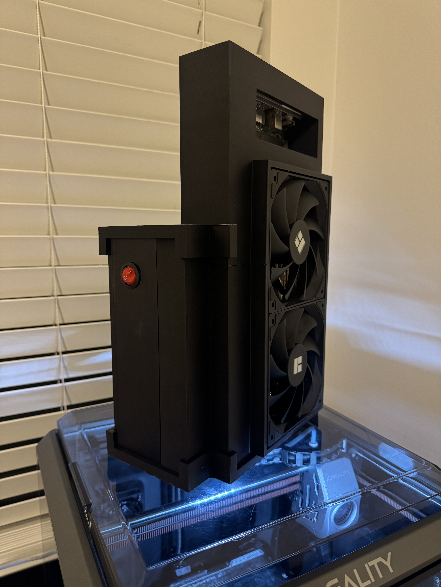

# BC250-MiniPC

# Build

## Resources:
### BIOS with options unlocked ( https://gitlab.com/TuxThePenguin0/bc250-bios )
### APU Governor ( https://gitlab.com/mothenjoyer69/oberon-governor )
### Better Documentation ( https://elektricm.github.io/amd-bc250-docs/ ) 
### More Documentation ( https://github.com/mothenjoyer69/bc250-documentation )

## Parts List:
### 1. Flex ATX PSU
### 2. 24 Pin ATX Power Supply Starter (Off/On Switch)
### 3. 2x 120mm PC Case Fans
### 4. BC-250 Board
### 5. M.2 SSD
### 6. ROM Programmer (ch341a USB Programmer or Raspberry PI)
### 7. 3D Printer Filament (ABS / ASA)
